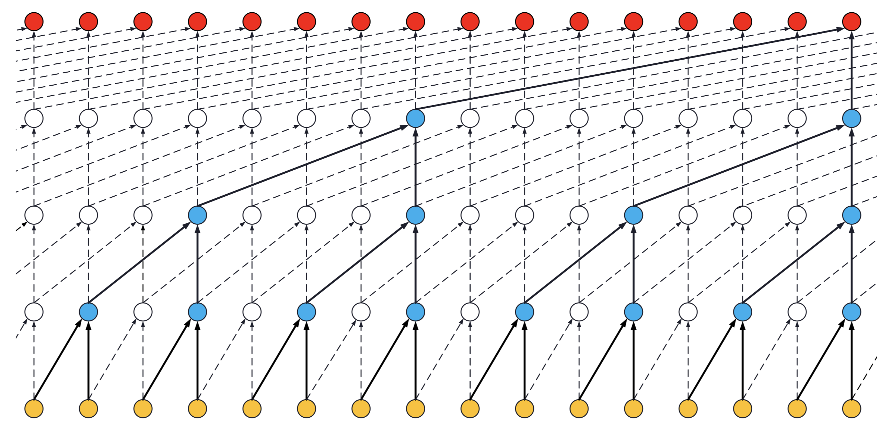
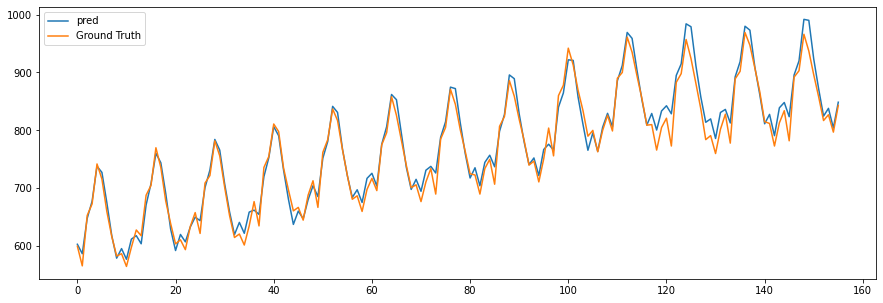

# ML Models on Time Series
Fun explorations for ML models on Time Series Datasets (Inertial sensors, among others)

## 1. TCN (Temporal Convolutions Network)
We increase the receptive field of convolution layers using dilation. Convolutions don't use the future inputs to make it usable in real-time settings, so it is causal. The folder contains working examples to show this in practice. How to find optimal hyperparameters; I will add a state-of-the-art [Mango](https://github.com/ARM-software/mango) optimizer example for this in the future. Some of hyperparameters used by me are available [here](https://github.com/ARM-software/mango/blob/master/benchmarking/Parameter_Spaces_Evaluated.ipynb). Credits: The TCN implementation in this repo uses [Keras-TCN](https://github.com/philipperemy/keras-tcn) library due to its ease of usage.

### 1.1 [TCN-based forecasting](https://github.com/sandeep-iitr/ML_Models_on_Time_Series/blob/main/TCN/TCN_Forecasting.ipynb) 

### 1.2 [TCN and CNN for Human Activity Recognition](https://github.com/sandeep-iitr/ML_Models_on_Time_Series/blob/main/TCN/TCN_Human_Activity_UCI.ipynb)
An example to show training of human activity models using the intertial sensors. The provided notebook shows comparisons of CNNs and TCN models with TCN model having as low as 10k parameters. 
